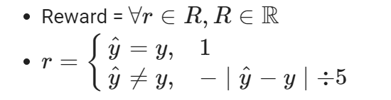

# Recommendation Gym for MovieLens

## 1. Overview

### 1.1 Summary
This project applies `Stable-Baselines`
algorithms to the `MovieLens 100k` data set.

To that end, the goal of the agent is to predict what rating 
a `user` will give to a given `movie`. 


### 1.2 Implementation

#### 1.2.1 Environment
The simulator is set up as a POMDP problem, using OpenAI's Gym framework
as the base class. 

The **reward** scheme is based on prediction accuracy:


The **observation** is based on derived features from the MovieLens data set:
- user_mean:  Average rating given by a specific user_id
- movie_mean: Average rating for a specific movie_id
- movie_genre_bucket: One-hot of the movie type
- age_bucket: One-hot of user's age range
- occupation_bucket: One-hot of the user's job
- gender_bucket: One-hot of the user's gender (only M or F)

#### 1.2.2 Agent
The Proximal Policy Optimization (PPO) algorithm is chosen to be the agent, since the 
recommendation problem is stateless (or single-state), thereby making a policy-base approach, 
opposed to a value-based, more appropriate.

Understanding that a given state does not impact future states in this problem, 
the $\gamma$ parameter is set to $0.0$ (gamma is used to discount future rewards).

#### 1.2.3 Neural network
An Multi-Layer Perceptron (MLP) is chosen for the agent's function approximator. Given the 
feature set is relatively small (~51 features), MLP with 2x layers of 64 neurons is sufficient and
does not appear to lead to overfitting.

#### 1.2.4 Other considerations
Two features provide the agent with an unfair advantage when making predictions:
- Average user rating
- Average movie rating

When collecting these features, the averages are taken over the entire
data set to prevent a $ValueError$ in Python, if a given *movie_id* or
*user_id* has not been seen before. This conflict can be avoided with
exception handling rules, but is out of scope for this experiment.


## 2. Getting Started

1. Run an experiment
```
python3 ppo_experiment.py --training_steps=100000 --evaluation_steps=10000
```
Refer to `ppo_experiment.py` for all the flags.

